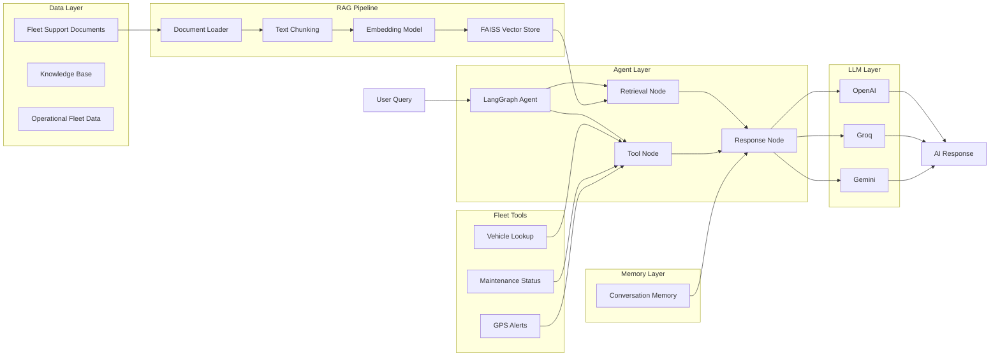

# Fleet Support RAG Assistant

An enterprise-grade AI-powered Fleet Operations Assistant built using Retrieval-Augmented Generation (RAG), Agentic AI workflows, LangGraph orchestration, semantic search, and multi-LLM support.

The system combines fleet management domain knowledge with modern Generative AI capabilities to automate customer support, operational queries, vehicle monitoring, and maintenance assistance.

---

## Project Overview

Fleet Support RAG Assistant enables fleet operators, dispatchers, and support teams to interact with fleet management data using natural language.

The platform combines:

* Retrieval-Augmented Generation (RAG)
* Semantic Search
* Agentic AI Workflows
* Tool Calling
* Conversation Memory
* Multi-LLM Support
* Fleet Operations Intelligence

---

## Business Problem

Fleet management organizations generate large volumes of operational data:

* GPS tracking events
* Vehicle telemetry
* Driver information
* Maintenance records
* Customer contracts
* Support tickets
* Operational alerts

Support teams spend significant time searching documentation, answering repetitive customer questions, and investigating operational incidents.

This solution provides an AI-powered assistant capable of retrieving operational knowledge, invoking fleet tools, and delivering contextual responses in real time.

---

## Key Features

### Retrieval-Augmented Generation (RAG)

* Document ingestion pipeline
* Intelligent text chunking
* Embedding generation
* Semantic retrieval
* Context-aware response generation

### Multi-LLM Support

Supports dynamic provider switching:

* OpenAI GPT Models
* Groq (Llama 3.3)
* Google Gemini
* Future support for Anthropic and Azure OpenAI

Benefits:

* Cost optimization
* Reliability
* Failover support
* Vendor independence

### Agentic AI Workflows

Built using LangGraph:

* Intelligent routing
* Multi-step execution
* Tool orchestration
* Decision-based workflows

### Conversation Memory

* Session management
* Multi-turn conversations
* Context preservation
* Conversational continuity

### Fleet Operations Tools

Current tools include:

#### Vehicle Lookup

Retrieve:

* Vehicle status
* Assigned driver
* Current speed
* Last known location

#### Maintenance Assistant

Retrieve:

* Maintenance schedules
* Odometer readings
* Service status

#### GPS Alert Monitoring

Retrieve:

* Overspeed alerts
* Geofence violations
* Maintenance alerts

### REST API

FastAPI endpoints:

| Endpoint                     | Description                |
| ---------------------------- | -------------------------- |
| GET /health                  | Service health check       |
| POST /ingest-documents       | Ingest knowledge documents |
| POST /search                 | Semantic search            |
| POST /chat                   | Agent interaction          |
| DELETE /session/{session_id} | Clear conversation session |

---

## 🏗️ Enterprise Agentic RAG Architecture



---

## Technology Stack

### Backend

* Python 3.11+
* FastAPI
* Uvicorn

### AI & GenAI

* LangChain
* LangGraph
* OpenAI
* Groq
* Gemini

### Vector Search

* FAISS
* Sentence Transformers

### Embeddings

* all-MiniLM-L6-v2

### Data Processing

* Pandas
* NumPy

### Storage

* FAISS Vector Index
* Future: PostgreSQL

### Frontend (Planned)

* Streamlit

### Deployment (Planned)

* Docker
* AWS ECS
* Kubernetes

---

## Repository Structure

```text
fleet-support-rag-assistant/

├── app/
│   ├── agents/
│   ├── api/
│   ├── embeddings/
│   ├── memory/
│   ├── prompts/
│   ├── rag/
│   ├── services/
│   ├── tools/
│   ├── utils/
│   └── vectorstore/
│
├── data/
├── docs/
├── tests/
├── streamlit_app/
│
├── requirements.txt
├── docker-compose.yml
├── README.md
└── .env.example
```

---

## Installation

### Clone Repository

```bash
git clone https://github.com/yourusername/fleet-support-rag-assistant.git

cd fleet-support-rag-assistant
```

### Create Virtual Environment

```bash
python -m venv venv

source venv/bin/activate
```

### Install Dependencies

```bash
pip install -r requirements.txt
```

### Configure Environment

Create:

```env
OPENAI_API_KEY=

GROQ_API_KEY=

GOOGLE_API_KEY=

LLM_PROVIDER=groq
```

---

## Run Document Ingestion

```bash
python -m app.rag.pipeline
```

Expected:

```text
Loaded documents
Generated chunks
Created FAISS index
```

---

## Start API

```bash
uvicorn app.main:app --reload
```

Open:

```text
http://localhost:8000/docs
```

---

## Example Chat Request

```json
{
  "session_id": "fleet-session-1",
  "query": "Show maintenance status and alerts for V102"
}
```

Example Response:

```json
{
  "response": "Vehicle V102 is active. Maintenance is due in 1200 km. Current alerts include Overspeed Alert and Geofence Exit Alert."
}
```

---

## Future Enhancements

### Phase 2

* PostgreSQL integration
* Real telemetry ingestion
* GPS event streaming
* Customer contract search

### Phase 3

* Multi-agent architecture
* Supervisor agent
* Route optimization agent
* Maintenance prediction agent

### Phase 4

* MCP Server integration
* OpenTelemetry tracing
* Kubernetes deployment
* AWS production deployment

---

## Skills Demonstrated

This project showcases:

* Retrieval-Augmented Generation (RAG)
* Agentic AI
* LangGraph
* LLM Orchestration
* Prompt Engineering
* Semantic Search
* Vector Databases
* Conversation Memory
* Tool Calling
* AI System Design
* Multi-LLM Architecture
* Enterprise AI Engineering
* FastAPI Development
* Production AI Patterns

---

## Resume Alignment

This project directly supports experience in:

* AI Engineering
* GenAI Engineering
* Applied AI
* Fleet Analytics
* Intelligent Operations
* Real-Time Event Processing
* Enterprise Software Architecture
* AI Agent Development
