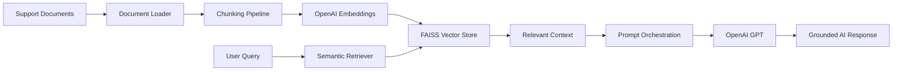

# Fleet Support RAG Assistant

LLM-powered customer support assistant using Retrieval-Augmented Generation (RAG), semantic retrieval, and conversational AI workflows for fleet management operations.

---

## 🚀 Features

- Retrieval-Augmented Generation (RAG)
- Semantic document retrieval
- Fleet support conversational assistant
- OpenAI-powered response generation
- FAISS vector database
- FastAPI backend
- Streamlit chat interface
- Document ingestion pipeline
- Intelligent text chunking
- Semantic document preparation
- OpenAI embedding generation
- FAISS vector database
- Semantic similarity search
- Context-aware retrieval
- LLM-powered grounded response generation
- Prompt orchestration pipeline
- Context-aware conversational AI
- OpenAI GPT integration

---

## 🏗️ Architecture



---

## 🛠️ Tech Stack

- Python
- FastAPI
- LangChain
- LangGraph
- OpenAI APIs
- FAISS
- Streamlit
- Docker

---

## 📦 Setup

### Install dependencies

```bash
pip install -r requirements.txt
```

### Run application

```bash
uvicorn app.main:app --reload
```

---

## 📡 API Endpoints

| Endpoint | Description |
|---|---|
| GET /health | Health check |
| POST /chat | Chat endpoint |

---

## 🔮 Future Enhancements

- Multi-agent support workflows
- PostgreSQL integration
- Conversation memory
- Real-time fleet telemetry integration
- Ticket automation

## Multi-LLM Provider Support

The system supports dynamic LLM provider switching for reliability and cost optimization.

Supported providers:
- OpenAI
- Groq
- Google Gemini

Embedding generation uses local HuggingFace models to avoid API quota limitations and reduce operational cost.